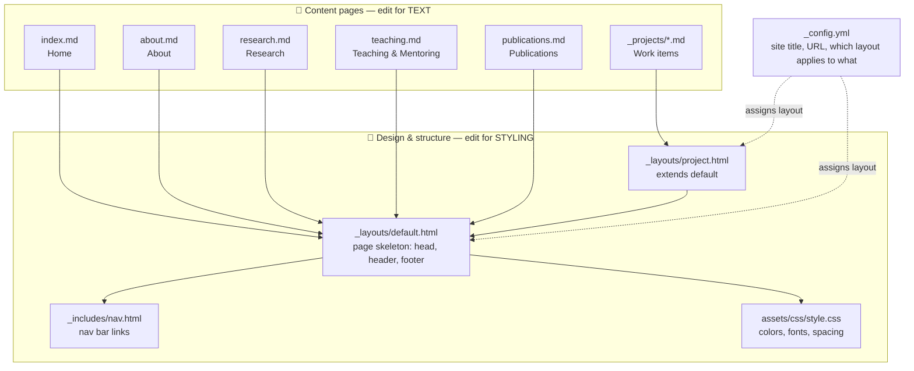

# Nadine Berner — GitHub Pages

A Jekyll-based personal research and data science portfolio.

## 🚀 Quick reference — "I want to change..."

| I want to change...                          | Edit this file                                  |
| --------------------------------------------- | ------------------------------------------------ |
| Home page text                                | `index.md`                                       |
| About / bio                                   | `about.md`                                       |
| Research themes                               | `research.md`                                    |
| Teaching & mentoring                          | `teaching.md`                                    |
| Publication list                              | `publications.md`                                |
| A project on `/work/...`                      | the matching file in `_projects/`                |
| Add a **new** project                         | add a new `.md` file in `_projects/` (see below) |
| Navigation bar (links at the top)             | `_includes/nav.html`                             |
| Overall page structure (header/footer/HTML)   | `_layouts/default.html`                          |
| Project-page structure                        | `_layouts/project.html`                          |
| Colors, fonts, spacing, look & feel            | `assets/css/style.css`                           |
| Site title, description, URL                  | `_config.yml`                                    |
| Your CV file                                  | `assets/cv/nadine-berner-cv.pdf`                 |

**Rule of thumb: content lives in `.md` files, design lives in `_layouts/`, `_includes/`, and `assets/css/style.css`.** You almost never need to touch both at once.

## 🗂 Repository structure



**How to read this:** every `.md` file at the root gets wrapped in `_layouts/default.html` (which pulls in the nav bar and the stylesheet). Files inside `_projects/` get wrapped in `_layouts/project.html` first, which itself is wrapped in `_layouts/default.html` — so project pages automatically get the same header, footer and styling as everything else, plus their own title/description block.

## ✏️ Editing content

Every content page is plain Markdown with a small YAML header (front matter) at the top:

```markdown
---
title: About
permalink: /about/
---

# About

Your text here, in normal Markdown.
```

You can safely edit anything below the second `---` without breaking the site. Only change the front matter (`title`, `permalink`, `description`) if you know what you're doing — `permalink` controls the page's URL.

### Adding a new project

1. Create a new file in `_projects/`, e.g. `_projects/my-new-project.md`
2. Add front matter:
   ```markdown
   ---
   title: My New Project
   description: One sentence describing it.
   ---
   Your project write-up here.
   ```
3. It will automatically appear at `/work/my-new-project/` (the URL pattern is set once in `_config.yml`, you don't need to repeat it).
4. To keep a project **in the repo but not live yet**, add `published: false` to its front matter. Remove that line when you're ready to publish.

### Adding a new top-level page (e.g. "Talks")

1. Create `talks.md` at the repo root with front matter (`title`, `permalink: /talks/`).
2. Add a link to it in `_includes/nav.html` so it shows up in the nav bar.

## 🎨 Editing styling

All visual design lives in three places:

- **`assets/css/style.css`** — colors, fonts, spacing, layout width. Look for `:root { ... }` at the top for the color palette and fonts; change values there to re-theme the whole site at once.
- **`_layouts/default.html`** — the HTML skeleton every page shares (header, footer, `<head>`). Edit this to add/remove things like a favicon, analytics script, or footer links.
- **`_includes/nav.html`** — the nav bar links themselves.

## 🖥 Local preview

Install Ruby and Bundler, then from the repo root:

```bash
bundle install
bundle exec jekyll serve --baseurl=""
```

Open <http://localhost:4000> and edit files — Jekyll rebuilds automatically on save.

## ☁️ Publishing

On GitHub: **Repository → Settings → Pages → Build and deployment → Source: GitHub Actions**. Pushing to `main` triggers the workflow in `.github/workflows/pages.yml`, which builds and deploys the site automatically. No manual build step needed.

## 🌐 Custom domain

If you want to use `nadineberner.eu` instead of `pyatwork.github.io`:

1. Update `url` in `_config.yml`.
2. Add a `CNAME` file at the repo root containing just the domain.
3. Configure the custom domain under **Settings → Pages → Custom domain**.

## 🧭 Design principle

The site is intentionally content-first: research credibility + real projects + restrained visual design, rather than a generic developer portfolio template.
